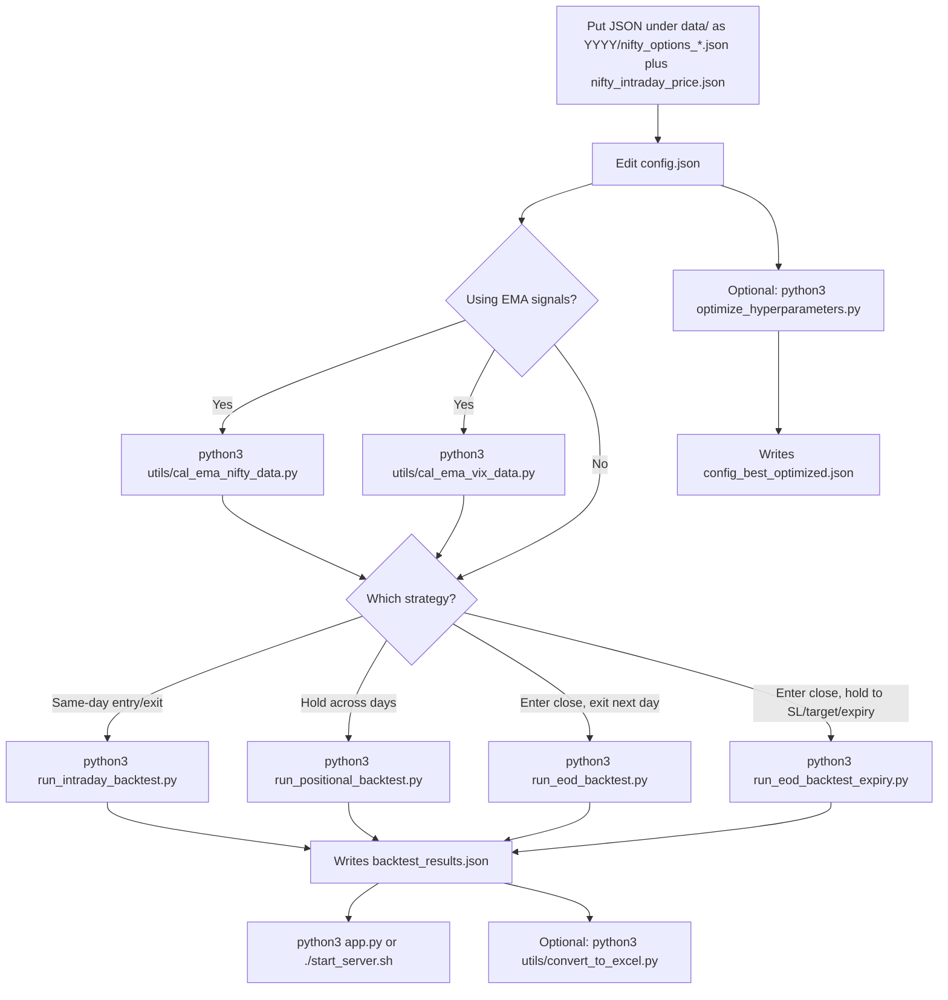

# Nifty Options Backtest

Backtests Nifty options strategies on local JSON data and shows results in a Flask dashboard. There are four runners: **intraday**, **positional**, **EOD next-day exit**, and **EOD hold-to-expiry**.

Market data is not in git. Put files under `data/` as described below. Never commit `backtest_results.json` or `*.db`.

```
backtest-trade/
├── LICENSE
├── README.md
├── app.py                         # Dashboard on http://localhost:3003
├── config.json                    # Parameters for the runners
├── config_optimization.json       # Base config for Optuna
├── optimization_params.example.json
├── optimize_hyperparameters.py
├── run_intraday_backtest.py       # One entry and exit per day
├── run_positional_backtest.py     # Multi-day, SL/TP, optional EMA and re-entry
├── run_eod_backtest.py            # Enter near close, exit next day
├── run_eod_backtest_expiry.py     # Enter near close, hold until SL, target, or expiry
├── start_server.sh
├── requirements.txt
├── templates/index.html
└── utils/
    ├── cal_ema_nifty_data.py
    ├── cal_ema_vix_data.py
    ├── convert_to_excel.py
    └── db_utils.py
```

## Setup

```bash
git clone https://github.com/KushalAzza/backtest-trade.git
cd backtest-trade
python3 -m venv venv
source venv/bin/activate
pip install -r requirements.txt
```

Place data here (gitignored):

```
data/
├── nifty_intraday_price.json
├── india_vix_intraday_price.json    # needed if you use the VIX filter
└── YYYY/
    ├── nifty_options_YYYY-MM-DD.json
    └── nifty_options_YYYY-MM-DD_next_expiry.json
```

Edit `config.json` for dates, times, strikes, lot size, stop-loss, target, VIX, EMA, and re-entry. Strike offsets live under `basic_settings` (`ce_strike_offset`, `pe_strike_offset`, `strike_rounding`).

## How to run

Pick **one** backtest script after the data is in place. EMA helpers are only needed if `ema_signals.enabled` is true. The dashboard and Excel export read `backtest_results.json`.



```bash
python3 run_intraday_backtest.py
# or python3 run_positional_backtest.py
# or python3 run_eod_backtest.py
# or python3 run_eod_backtest_expiry.py

./start_server.sh
# open http://localhost:3003

python3 utils/convert_to_excel.py
```

Copy `optimization_params.example.json` to `optimization_params.json` if you want to change Optuna ranges. Default is 200 trials. The study file `nifty_options_optimization.db` is gitignored. Copy `config_best_optimized.json` over `config.json` only if you want to use those parameters.

The dashboard can start **intraday** or **positional** from the UI (`backtest_period.use_positional`). EOD scripts are CLI-only.

## License

MIT. See [LICENSE](LICENSE).
